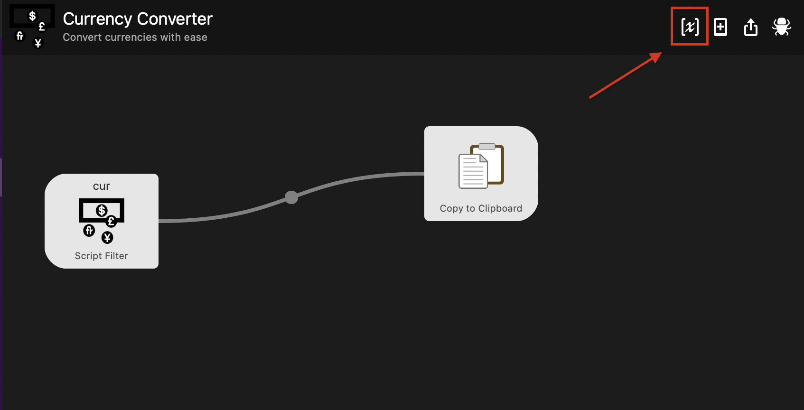

# Currency Converter for Alfred App

Currency Converter is a workflow for Alfred App on Mac. This is based on the Google currency conversion syntax, such as `30 USD in GBP`.

The basic way to use the converter is to call Alfred with:

> c 30 USD in EUR

Note that `in` and `to` are interchangable. The default currency is GBP (can be changed) so the following will convert from USD to GBP:

> c 30USD

Another shorthand is:

> c 30$ to €

And even shorter:

> c 30$ €

## Installation

[Download](./Currency%20Converter.alfredworkflow) and open the workflow file.

Set up api key

1. Create an account at [https://exchangerate-api.com](https://exchangerate-api.com/)
2. Create an API key at [https://app.exchangerate-api.com/keys](https://app.exchangerate-api.com/keys)
3. Open the workflow and click "Configure workflow and variables"
4. Set up `API_KEY` with your own key

   
5. Optional: Change the `DEFAULT_CURRENCY` with your own preference

## Requirements

- [Alfred 2.0](http://www.alfredapp.com/) or higher
- [Alfred PowerPack](http://www.alfredapp.com/powerpack/)

## Authors

- [Søren Louv-Jansen](https://twitter.com/sorenlouv)
- Martin Zürn
- [Remy sharp](https://remysharp.com)
